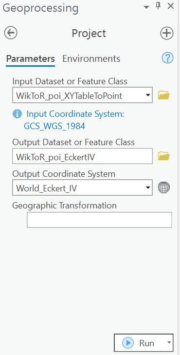
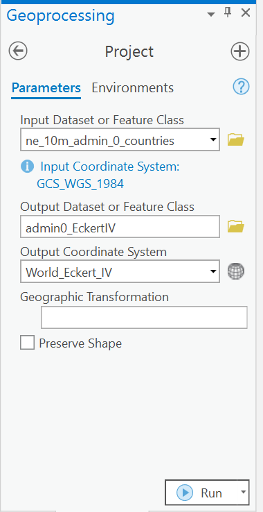
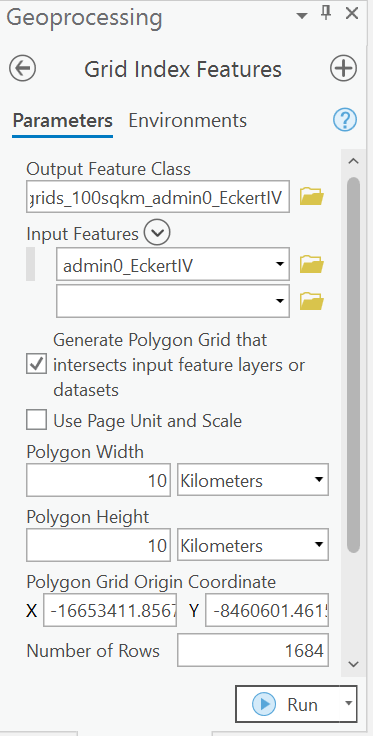
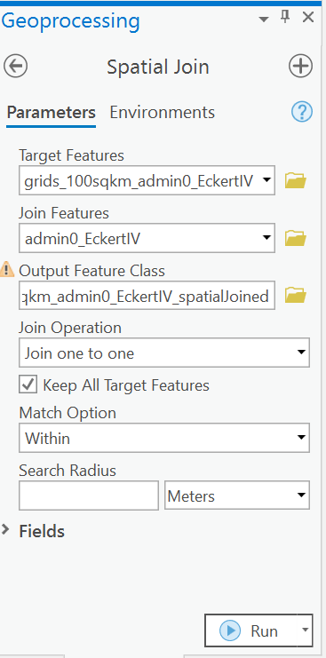
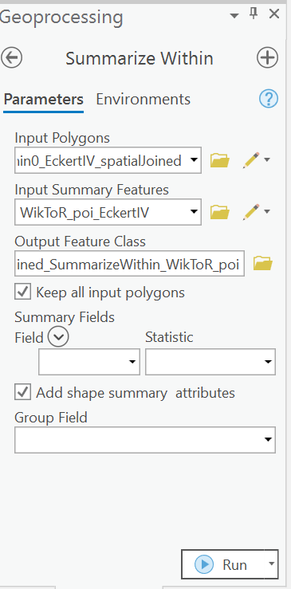
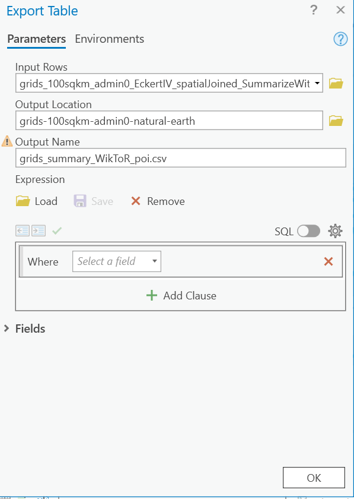
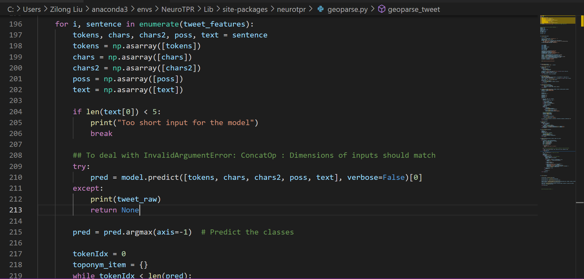

# Geoparsing: Solved or Biased? An Evaluation of Geographic Biases in Geoparsing
In this repository, we provide descriptions about how to reproduce our evaluation study. More information can found in our paper "Geoparsing: Solved or Biased? An Evaluation of Geographic Biases in Geoparsing" accepted by [AGILE 2022](https://agile-online.org/index.php/conference-2022). 

## Downloading Datasets
To reproduce our data preprocessing steps, you need to download several datasets first and put them in corresponding directories. Alternatively, you can also directly use our shared preprocessed datasets and jump to the **Deploying Geoparsers** section.

The country/region shapefile can be accessed as [Admin-0 Countries](https://www.naturalearthdata.com/http//www.naturalearthdata.com/download/10m/cultural/ne_10m_admin_0_countries.zip) from [Natural Earth](https://www.naturalearthdata.com), and should be put in [`data/admin0-natural-earth/`](data/admin0-natural-earth/). LGL, GeoVirus, and WikToR can be accessed [here](https://github.com/milangritta/Geocoding-with-Map-Vector/tree/master/data), and should be put in [`data/evaluation-corpora/original-datasets/`](data/evaluation-corpora/original-datasets/). Their data patches can be accessed [here](https://github.com/google-research-datasets/mlg_evaldata), and should be put in [`data/evaluation-corpora/data-patches/`](data/evaluation-corpora/data-patches/). GeoCorpora can be accessed [here](https://github.com/geovista/GeoCorpora), and should be put in [`data/evaluation-corpora/original-datasets/`](data/evaluation-corpora/original-datasets/). GeoWiki can be accessed [here](https://www.repository.cam.ac.uk/bitstream/handle/1810/277772/geowiki.txt.zip?sequence=5&isAllowed=y), and should be put in
[`data/training-corpora/`](data/training-corpora/). The [GeoNames](http://www.geonames.org/) gazetteer used by [CamCoder](https://github.com/milangritta/Geocoding-with-Map-Vector) can be accessed [here](https://www.repository.cam.ac.uk/bitstream/handle/1810/277772/allCountries.txt.zip?sequence=4&isAllowed=y), and should be put in [`data/gazetteers/`](data/gazetteers/).

## Data Preprocessing
### Annotated Location Extraction
To achieve both our spatially-explicit geoparsing performance evaluation and geographic bias evaluation, we extracted all annotated locations from training and evaluation corpora as well as the GeoNames gazetteer. The script used is [`scripts/annotated-poi-extraction.ipynb`](scripts/annotated-poi-extraction.ipynb). These extracted locations are stored in [`data/extracted-annotated-locations/`](data/extracted-annotated-locations/). 

### Splitting Articles in LGL, GeoVirus, and WikToR
To more easily run [Edinburgh Geoparser](https://www.inf.ed.ac.uk/research/isdd/admin/package?view=1&id=199), we split articles in LGL, GeoVirus, and WikToR into separate datasets, which can be found at [`data/evaluation-corpora/split-datasets/`](data/evaluation-corpora/split-datasets/).

### Grid Summary Generation
For the representation bias analysis, we generated grids containing a summary about the number of annotated locations located within for different datasets, respectively. This grid summary generation process was done in ArcGIS Pro 2.9.0. An example of using extracted annotated locations from WikToR is attached below.

(1) First, use [XY Table To Point](https://pro.arcgis.com/en/pro-app/latest/tool-reference/data-management/xy-table-to-point.htm) to convert WikToR's annotated locations into point features.

(2) Then, use [Project](https://pro.arcgis.com/en/pro-app/latest/tool-reference/data-management/project.htm) to project the point features from WGS 1984 to Eckert IV (World), which is the selected projected coordinate system in our study.

(3) After adding the country/region shapefile to the map project, apply the same projection to it.

(4) Use [Grid Index Features](https://pro.arcgis.com/en/pro-app/latest/tool-reference/cartography/grid-index-features.htm) to generate grids from the country/region polygon features.

(5) Then, use [Spatial Join](https://pro.arcgis.com/en/pro-app/latest/tool-reference/analysis/spatial-join.htm) to join the country/region polygon features and grids to add the country/region information to every grid. 

(6) Use [Summarize Within](https://pro.arcgis.com/en/pro-app/latest/tool-reference/analysis/summarize-within.htm) to summarize the number of annotated locations within each grid.

(7) Use [Export Table](https://pro.arcgis.com/en/pro-app/latest/help/data/tables/export-tables.htm) to export the attribute table of grid features to [`data/grids-100sqkm-admin0-natural-earth/`](data/grids-100sqkm-admin0-natural-earth/).

Note that you only need to perform step (2) to step (5) **once** to generate grids from the country/region shapefile. You can repeat step (1), step (6), and step (7) to generate grid summary for LGL, GeoVirus, GeoWiki, GeoCorpora, and GeoNames. 

## Deploying Geoparsers
For toponym recognition, we used [spaCy](https://spacy.io/usage) and [NeuroTPR](https://github.com/geoai-lab/NeuroTPR). Because NeuroTPR uses [tensorflow_hub](https://www.tensorflow.org/hub/installation) which only supports Tensorflow 1.15 instead of Tensorflow 1.14, make sure you install Tensorflow 1.15. To deal with `InvalidArgumentError: ConcatOp : Dimensions of inputs should match` that you may encounter, starting from line 208 you can change `geoparse.py` used by NeuroTPR as below.

For toponym resolution, we used 

## Spatially-Explicit Geoparsing Performance Evaluation

## Geographic Bias Evaluation